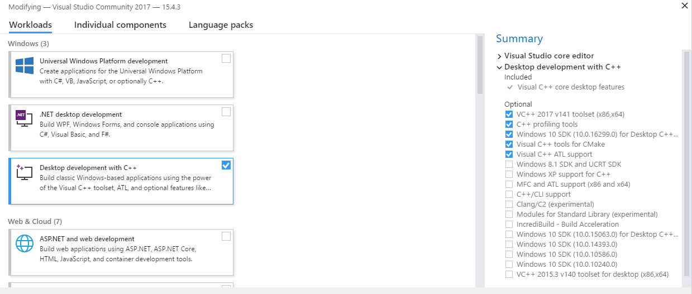

# CalculatorBoostRegex
This console calculator use the regular expressions for the parsing of the input for the detecting of the numbers and the mathematical signs.

It is nice for the complicated calculations with many numbers and brackets. You can use ^ or ** for the power operation, any brackets as you want (){}[] and operations +-*/

# Calculator in work
```
It is a calculator
Enter q for quit
Enter help, h or ? for information
inp[1]:{[1+2+3]/(4+5+6+7)}^{8*9}
out[1]:2.35736e-41={[1+2+3]/(4+5+6+7)}^{8*9}
```
# Platform

Operation system Windows 10 or Linux. Also, TermuxArch in Android is Linux too.

# Programming language

C++

# Requirement
**Windows**
Download and install **Visual Studio Comunity Edition** https://www.visualstudio.com

Along install select **Desctop development with C++**, as it imaged on the picture.



Download and install **Git** https://git-scm.com/
**Linux**
Install GCC, Git and Boost by your package manager.

# Building
**Windows**

From the Windows start menu open **Developer Command Prompt for VS2017**

Do it:

```
git clone https://github.com/abicorios/CalculatorBoostRegex

cd CalculatorBoostRegex

Make.bat
```

The result is the **CalculatorBoostRegex.exe** file in the **x64\Release** folder.

The **Make.bat** script run **nuget restore** command, which download **boost_regex-vc141** NuGet prebuilded package https://www.nuget.org/packages/boost_regex-vc141/, which need 580 MB disk space. Thank you, Sergey Shandar, for building **boost_regex-vc141** package.
**Linux**
Run **make.sh**.
